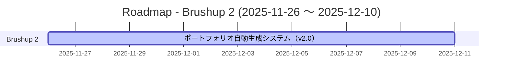

# Roadmap - Brushup 2

- [ ] ポートフォリオ自動生成システム（v2.0） （予定: 2025-11-26〜2025-12-10）
    - コードベースから直接情報を抽出してエクセルに自動入力するシステムを実装する。マークダウンレポート経由方式を廃止し、動的パターンマッチングによる柔軟なファイル探索を実装する。 / [仕様](tasks/portfolio-generation-spec-v2.md)

## ガントチャート

