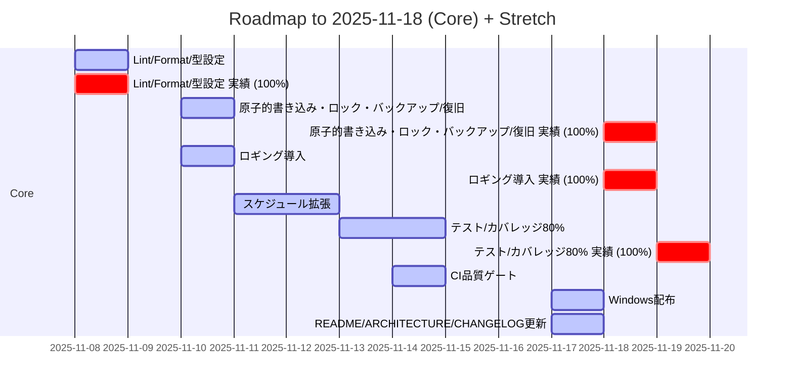

# Roadmap

- [x] Lint/Format/型設定 （予定: 2025-11-08） （実績: 2025-11-08）
    - 開発環境のLint/Formatter/型チェック設定を整備する。 / [レポート](reports/setup-tooling.md)
- [x] 原子的書き込み・ロック・バックアップ/復旧 （予定: 2025-11-10） （実績: 2025-11-18）
    - 設定・タスクファイルの原子的書き込みとロック、バックアップ/復旧を実装する。 / [仕様](tasks/io-safety.md) / [レポート](reports/io-safety.md)
- [x] ロギング導入 （予定: 2025-11-10） （実績: 2025-11-18）
    - アプリ全体にロギング基盤を導入し、主要イベントを記録する。 / [仕様](tasks/logging.md) / [レポート](reports/logging.md)
- [ ] スケジュール拡張 （予定: 2025-11-11〜2025-11-12）
    - タスク・スケジュールのモデルを拡張し、柔軟な通知・スヌーズに対応できるようにする。 / [仕様](tasks/schedule-model.md)
- [x] テスト/カバレッジ80% 依存: io-safety, schedule-model （予定: 2025-11-13〜2025-11-14） （実績: 2025-11-19）／>=60% by 2025-11-14 (80% later) → 79%達成
    - コアロジックの自動テストを追加し、カバレッジを所定の水準まで引き上げる。 / [仕様](tasks/tests-core.md) / [レポート](reports/tests-core.md)
- [ ] CI品質ゲート 依存: tests-core （予定: 2025-11-14）
    - CI上でテストと品質ゲートを実行し、一定品質を満たさない変更をブロックする。
- [ ] Windows配布 依存: ci-quality （予定: 2025-11-17）
    - Windows向けの配布パッケージを作成し、配布プロセスを確立する。 / [仕様](tasks/package-win.md)
- [ ] README/ARCHITECTURE/CHANGELOG更新 依存: package-win （予定: 2025-11-17）
    - READMEやアーキテクチャドキュメント、CHANGELOGを最新状態に更新する。 / [仕様](tasks/docs.md)

- [ ] スケジュールUI 依存: schedule-model
    - スケジュールを確認・編集できるUIを作成する。
- [ ] 通知ディスパッチ 依存: schedule-model
    - 各種通知を集約・ディスパッチする仕組みを実装する。
- [ ] Win/Mac表示差異吸収
    - Windows/macOSの表示差異を吸収し、共通のUI体験を提供する。
- [ ] macOS配布 依存: platform-ui, ci-quality
    - macOS向けの配布パッケージを作成し、配布プロセスを確立する。
- [ ] MCP自動化 依存: ci-quality
    - MCPを使った自動化フローを構築し、定型作業を減らす。
- [ ] デモGIF作成 依存: schedule-ui, notifications
    - 主要なユースケースを示すデモGIFを作成する。
- [ ] アーキ図/通知シーケンス図 依存: notifications
    - アーキテクチャ図と通知シーケンス図を作成し、構成とフローを可視化する。

## ガントチャート（コア完了 〜 2025-11-18）

