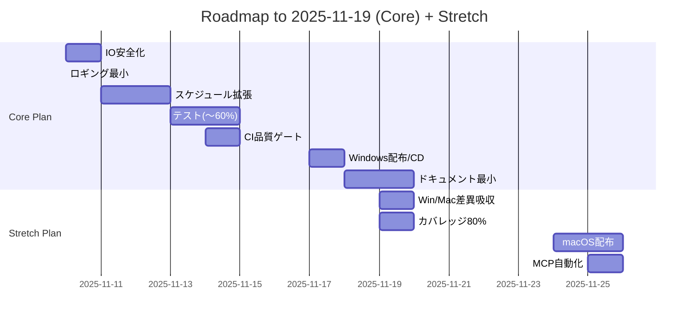

# Roadmap

- [x] Lint/Format/型設定（ruff/black/mypy、pre-commit）
- [ ] 原子的書き込み・ロック・バックアップ/復旧（utils/io_safety.py）
- [ ] ロギング導入（utils/logging_setup.py）
- [ ] スケジュール拡張（once/weekday/monthly）
- [ ] スケジュールUI（tkinter） 依存: スケジュール拡張
- [ ] 通知ディスパッチ（予告→本→警告→ログ） 依存: スケジュール拡張
- [ ] Win/Mac表示差異吸収（ui/platform.py）
- [ ] テスト/カバレッジ80% 依存: IO安全化, スケジュール拡張 （予定: 2025-11-13〜2025-11-14／まずは>=60%）
- [ ] CI品質ゲート（lint/type/test） 依存: テスト （予定: 2025-11-14）
- [ ] Windows配布（PyInstaller） 依存: CI （予定: 2025-11-17）
- [ ] macOS配布 依存: UI標準化, CI
- [ ] MCP自動化 依存: CI
- [ ] デモGIF作成 依存: スケジュールUI, 通知
- [ ] アーキ図/通知シーケンス図（Mermaid） 依存: 通知
- [ ] README/ARCHITECTURE/CHANGELOG更新 依存: 配布/図/GIF （予定: 2025-11-18〜2025-11-19）

参考:
- Git戦略: `.cursor/git-strategy.md`
- アーキ図/シーケンス: `docs/diagrams/`（後続で追加）

## ガントチャート（コア完了 〜 2025-11-19）

