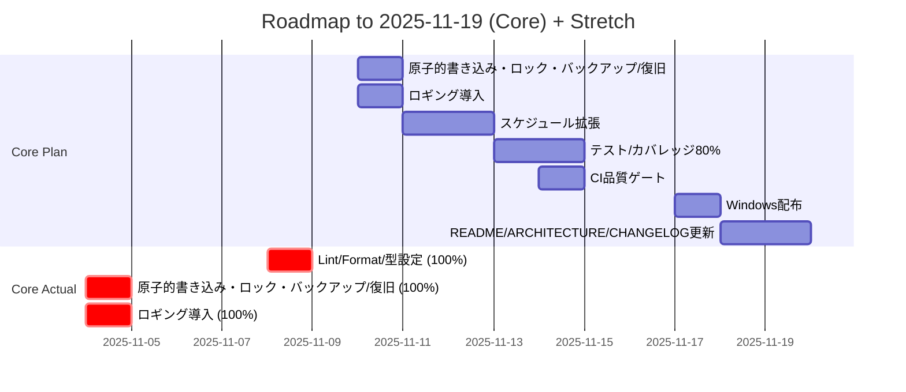

# Roadmap

- [x] Lint/Format/型設定 （実績: 2025-11-08）
- [x] 原子的書き込み・ロック・バックアップ/復旧 （予定: 2025-11-10） （実績: 2025-11-04）
- [x] ロギング導入 （予定: 2025-11-10） （実績: 2025-11-04）
- [ ] スケジュール拡張 （予定: 2025-11-11〜2025-11-12）
- [ ] テスト/カバレッジ80% 依存: io-safety, schedule-model （予定: 2025-11-13〜2025-11-14）／>=60% by 2025-11-14 (80% later)
- [ ] CI品質ゲート 依存: tests-core （予定: 2025-11-14）
- [ ] Windows配布 依存: ci-quality （予定: 2025-11-17）
- [ ] README/ARCHITECTURE/CHANGELOG更新 依存: package-win （予定: 2025-11-18〜2025-11-19）

- [ ] スケジュールUI 依存: schedule-model
- [ ] 通知ディスパッチ 依存: schedule-model
- [ ] Win/Mac表示差異吸収
- [ ] macOS配布 依存: platform-ui, ci-quality
- [ ] MCP自動化 依存: ci-quality
- [ ] デモGIF作成 依存: schedule-ui, notifications
- [ ] アーキ図/通知シーケンス図 依存: notifications

## ガントチャート（コア完了 〜 2025-11-19）

