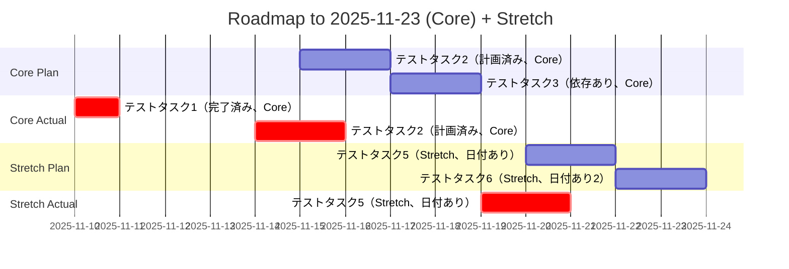

# テストロードマップ（カテゴリ対応）

- [x] テストタスク1（完了済み、Core） （実績: 2025-11-10）
- [ ] テストタスク2（計画済み、Core） （予定: 2025-11-15〜2025-11-16） （実績: 2025-11-14〜2025-11-15）
- [ ] テストタスク3（依存あり、Core） 依存: task-2 （予定: 2025-11-17〜2025-11-18）

- [ ] テストタスク4（Stretch、日付なし）
- [ ] テストタスク5（Stretch、日付あり） （予定: 2025-11-20〜2025-11-21） （実績: 2025-11-19〜2025-11-20）
- [ ] テストタスク6（Stretch、日付あり2） （予定: 2025-11-22〜2025-11-23）

## ガントチャート（コア完了 〜 2025-11-23）

