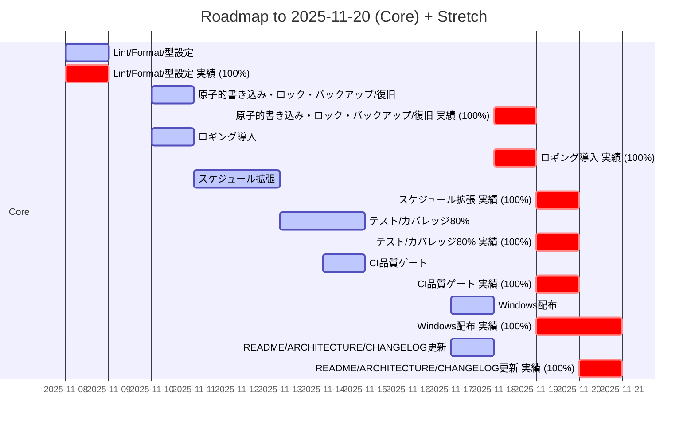
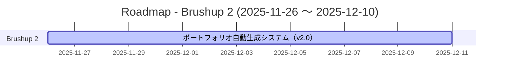

# セル: 工夫点・苦労点 (D49)

## 説明
本成果物を作成する際の工夫点と苦労点。課題をどう乗り越えたか記載。コードベースから工夫点・苦労点・課題解決のプロセスを抽出し、約500文字に要約して記入

## 文字数制限
最大: 500文字

## 変換ルール
`summarize_to_length`

## 参照すべきコードベースソース
- `README.md`
- `ARCHITECTURE.md`
- `CHANGELOG.md`
- `git`
- `semantic_search`

## コードベースコンテキスト

### 関連ファイルの内容

#### C:\Users\ND003\Desktop\定型作業支援ツール\README.md

```
# TaskReminder

発達障害のある方向けの定型業務サポートツールです。出勤退勤の報告や日報の提出などの定型業務を忘れがちな方のために、リマインダー機能とチェックボックス付きの作業表を提供します。

## 機能

### 1. リマインダー機能
- **予告通知**: 設定時刻の5分前に小さな通知ウィンドウを表示
- **本通知**: 設定時刻にタスク名とチェックボックスを表示
- **警告通知**: 未完了の場合、5分後に画面中央で警告表示

### 2. タスク管理
- タスクの追加・編集・削除
- 複数タスクの同時設定（例：14:30に日報、勤怠報告、勤務表）
- 毎日繰り返し設定

### 3. ログ・達成率表示
- タスク完了履歴の記録
- 月ごとの達成率表示
- 過去12ヶ月の未達成率グラフ

### 4. 常駐機能
- タスクバーに常駐
- バックグラウンドでの時刻監視
- 設定画面・ログ画面へのアクセス

### 5. 達成率計算設定
- **週末除外設定**: 土日を達成率計算から除外する設定
- **カレンダーオーバーライド**: 日単位で達成率の対象日を個別に設定可能
  - 週末除外設定を有効にしても、特定の土日を含めることが可能
  - 平日でも特定の日を除外することが可能

## インストール・使用方法

### Windows版（推奨）

Python環境が不要な、単一のexeファイル版を提供しています。

#### ダウンロード

1. [GitHub Releases](https://github.com/takenet193/task-reminder-tool/releases)から最新版をダウンロード
2. `TaskReminder.exe`をダウンロード

#### インストール手順

1. ダウンロードした`TaskReminder.exe`を任意のフォルダに配置
2. exeファイルをダブルクリックして起動
3. 初回起動時に、exeファイルと同じディレクトリに`data/`フォルダが自動作成されます

#### システム要件

- Windows 10以降
- 管理者権限不要
- Python環境不要

#### トラブルシューティング（Windows版）

- **ウイルススキャンの誤検知**: PyInstallerで生成したexeは誤検知されやすい場合があります。信頼できるソース（GitHub Releases）からのダウンロードであることを確認してください。
- **起動が遅い**: 初回起動時は一時ファイルの展開により、やや時間がかかることがあります（通常5秒以内）。
- **データファイルの場所**: データファイル（`data/`フォルダ）は、exeファイルと同じディレクトリに作成されます。

#### チェックサム検証

ダウンロードしたexeファイルの整合性を確認するには、以下のコマンドを実行してください：

```powershell
Get-FileHash -Path "TaskReminder.exe" -Algorithm SHA256
```

GitHub Releasesに記載されているSHA256ハッシュ値と一致することを確認してください。

### 開発者向けインストール（Python環境が必要）

#### 必要な環境
- Python 3.13以上（推奨）
- tkinter（Python標準ライブラリ）
- matplotlib

#### 開発ツール（オプション）
- ruff: リントチェック
- black: コードフォーマット
- mypy: 型チェック
- pytest: テスト実行

#### インストール手順

1. リポジトリをクローンまたはダウンロード
```bash
git clone <repository-url>
cd TaskReminder
```

2. 依存パッケージをインストール
```bash
pip install -r requirements.txt
```

3. MCP設定（GitHub連携用）
```bash
# .envファイルを作成（mcp_setup/env.exampleを参考）
cp mcp_setup/env.example .env
# .envファイルを編集してGitHubトークンを設定

# MCP設定ファイルを生成（ワークスペースパスは絶対パスで指定してください）
# PowerShell（Windows）
powershell -ExecutionPolicy Bypass -File "mcp_setup\scripts\generate_mcp_config.ps1" -WorkspacePath "C:\path\to\your\workspace"

# Bash（Linux/macOS）
bash mcp_setup/scripts/generate_mcp_config.sh /path/to/your/workspace
```

4. アプリケーションを起動
```bash
python main.py
```

#### 開発環境での品質チェック

CIと同じ品質チェックをローカルで実行できます：

**Linux/macOS:**
```bash
bash scripts/ci-check.sh
```

**Windows:**
```powershell
.\scripts\ci-check.ps1
```

このスクリプトは以下のチェックを実行します：
- テスト実行とカバレッジチェック（60%以上）
- ruffリントチェック
- blackフォーマットチェック
- mypy型チェック

#### CI/CD

このプロジェクトはGitHub Actionsで自動的に品質チェックを実行します：
- **テスト**: pytest実行とカバレッジチェック（60%以上）
- **リント**: ruffリントチェック
- **フォーマット**: blackフォーマットチェック
- **型チェック**: mypy型チェック

プルリクエストや`main`/`develop`ブランチへのプッシュ時に自動実行されます。

### 基本的な使用方法

1. **アプリケーション起動**
   - `python main.py`でアプリケーションを起動
   - タスクバーに小さなウィンドウが表示されます

2. **タスク設定**
   - メインウィンドウの「タスク設定」ボタンをクリック
   - 「追加」ボタンで新しいタスクを追加
   - 時刻（HH:MM形式）とタスク名を入力
   - 複数のタスク名を設定可能

3. **通知の確認**
   - 設定時刻の5分前に予告通知が表示
   - 設定時刻に本通知が表示
   - チェックボックスをすべてチェックして「完了」ボタンをクリック

4. **ログ・達成率の確認**
   - メインウィンドウの「ログ・達成率」ボタンをクリック
   - 月ごとの達成率とグラフを確認
   - 「対象日設定」タブで週末除外設定やカレンダーオーバーライドを設定可能

## PC起動時の自動起動設定

### Windows 10/11の場合

1. **スタートアップフォルダを使用する方法**
   ```
   1. Win + R キーを押して「ファイル名を指定して実行」を開く
   2. shell:startup と入力してEnter
   3. スタートアップフォルダが開く
   4. アプリケーションのショートカットを作成してコピー
   ```

2. **タスクスケジューラーを使用する方法**
   ```
   1. タスクスケジューラーを開く
   2. 「基本タスクの作成」を選択
   3. 名前: 「TaskReminder」
   4. トリガー: 「コンピューターの起動時」
   5. 操作: 「プログラムの開始」
   6. プログラム: python.exeのパス
   7. 引数: main.pyのフルパス
   8. 開始: プロジェクトフォルダのパス
   ```

3. **レジストリを使用する方法**
   ```
   1. Win + R キーを押してregeditを実行
   2. HKEY_CURRENT_USER\Software\Microsoft\Windows\CurrentVersion\Run
   3. 新しい文字列値を作成
   4. 名前: 「TaskReminder」
   5. 値: 「python.exe main.pyのフルパス」
   ```

### 推奨設定

- **タスクスケジューラー**を使用することを推奨します
- 遅延起動を設定して、システム起動後にアプリケーションが起動するようにします
- 管理者権限は不要です（現在のユーザーで実行）

## GitHub連携とMCP設定

このプロジェクトは、CursorエディタとGitHubを連携させるためのMCP（Model Context Protocol）設定を含んでいます。

### MCP設定の詳細

1. **GitHub連携**
   - GitHubリポジトリへのアクセス
   - Issue、PR、コミット履歴の参照
   - コードレビューの支援

2. **ファイルシステム連携**
   - プロジェクトファイルへの直接アクセス
   - コードの検索と編集支援

### GitHubトークンの設定

1. **Personal Access Tokenの作成**
   - GitHub.com にログイン
   - Settings > Developer settings > Personal access tokens > Tokens (classic)
   - "Generate new token (classic)" をクリック
   - 必要なスコープを選択: `repo`, `read:org`, `read:user`
   - トークンをコピー

2. **環境変数の設定**
   ```bash
   # .envファイルを作成
   cp mcp_setup/env.example .env

   # .envファイルを編集してトークンを設定
   GITHUB_PERSONAL_ACCESS_TOKEN=your_actual_token_here
   ```

3. **MCP設定ファイルの生成**
   ```bash
   # PowerShell（Windows）
   # ワークスペースパスは絶対パスで指定してください
   powershell -ExecutionPolicy Bypass -File "mcp_setup\scripts\generate_mcp_config.ps1" -WorkspacePath "C:\path\to\your\workspace"

   # Bash（Linux/macOS）
   # ワークスペースパスは絶対パスで指定してください
   bash mcp_setup/scripts/generate_mcp_config.sh /path/to/your/workspace
   ```

   **注意**: `filesystem` MCPは絶対パスが必要です。相対パスでは動作しません。

4. **Cursorでの設定**
   - Cursorの設定でMCP設定ファイル（`mcp_config.json`）を指定
   - 設定 > MCP Servers で設定ファイルのパスを指定

## ファイル構成

```
Task
...
```
*（ファイルの一部のみ表示。全内容は 7588 文字）*

#### C:\Users\ND003\Desktop\定型作業支援ツール\ARCHITECTURE.md

```
# TaskReminder アーキテクチャドキュメント

## 概要

TaskReminderは、発達障害のある方向けの定型業務サポートツールです。タスクのリマインダー機能と達成率管理機能を提供するデスクトップアプリケーションです。

## システムアーキテクチャ

### 全体構成

```
┌─────────────────────────────────────────────────────────┐
│                    TaskReminder                          │
├─────────────────────────────────────────────────────────┤
│                                                           │
│  ┌──────────────┐      ┌──────────────┐                │
│  │  main.py     │──────│ TaskManager  │                │
│  │ (Entry Point)│      │ (Scheduler)  │                │
│  └──────┬───────┘      └──────┬───────┘                │
│         │                      │                         │
│         │                      │                         │
│  ┌──────▼───────┐      ┌──────▼───────┐                │
│  │ UI Layer     │      │ Config        │                │
│  │ - MainWindow │      │ (Data I/O)    │                │
│  │ - Reminder   │      └──────┬───────┘                │
│  │ - Settings   │             │                         │
│  │ - LogWindow  │      ┌──────▼───────┐                │
│  └──────────────┘      │ utils/        │                │
│                        │ - file_io     │                │
│                        │ - schedule    │                │
│                        └──────┬───────┘                │
│                               │                         │
│                        ┌──────▼───────┐                │
│                        │ data/        │                │
│                        │ - tasks.json │                │
│                        │ - logs.json  │                │
│                        │ - settings   │                │
│                        └──────────────┘                │
└─────────────────────────────────────────────────────────┘
```

## モジュール構成

### 1. エントリーポイント

#### `main.py`
- **役割**: アプリケーションのエントリーポイント
- **責務**:
  - ロギング設定の初期化
  - TaskManagerのインスタンス化
  - UIコンポーネントの初期化と起動
  - exe環境と開発環境の両方に対応したログファイルパスの設定

### 2. コアモジュール

#### `task_manager.py`
- **役割**: タスク管理とスケジューリングの中核
- **責務**:
  - タスクの時刻監視（バックグラウンドスレッド）
  - 通知タイミングの計算とトリガー
  - 通知コールバックの管理
  - アクティブな通知の追跡
- **主要メソッド**:
  - `start_monitoring()`: 監視スレッドの開始
  - `stop_monitoring()`: 監視スレッドの停止
  - `_monitor_tasks()`: メイン監視ループ
  - `_trigger_pre_notification()`: 予告通知のトリガー
  - `_trigger_main_notification()`: 本通知のトリガー
  - `_trigger_warning_notification()`: 警告通知のトリガー

#### `config.py`
- **役割**: 設定管理とデータI/O
- **責務**:
  - JSONファイルの読み書き
  - タスクデータの管理（追加・更新・削除）
  - ログデータの管理
  - 設定データの管理（週末除外設定など）
  - カレンダーオーバーライドの管理
  - exe環境と開発環境の両方に対応したベースディレクトリの取得
- **主要メソッド**:
  - `load_tasks()`: タスクデータの読み込み
  - `save_tasks()`: タスクデータの保存
  - `add_task()`: タスクの追加
  - `update_task()`: タスクの更新
  - `delete_task()`: タスクの削除
  - `load_logs()`: ログデータの読み込み
  - `save_logs()`: ログデータの保存
  - `is_date_included()`: 達成率計算対象日の判定

### 3. UIモジュール (`ui/`)

#### `main_window.py`
- **役割**: メインウィンドウ（タスクバー常駐）
- **責務**:
  - アプリケーションのメインウィンドウ表示
  - 設定画面・ログ画面へのアクセス提供
  - ウィンドウの最小化・閉じる処理

#### `reminder_window.py`
- **役割**: リマインダー通知ウィンドウ
- **責務**:
  - 予告通知の表示
  - 本通知の表示（チェックボックス付き）
  - 警告通知の表示
  - タスク完了の記録

#### `settings_window.py`
- **役割**: タスク設定画面
- **責務**:
  - タスクの追加・編集・削除UI
  - タスクの有効/無効切り替え
  - タスク一覧の表示

#### `log_window.py`
- **役割**: ログ・達成率表示画面
- **責務**:
  - 月ごとの達成率表示
  - 過去12ヶ月の未達成率グラフ表示
  - 週末除外設定のUI
  - カレンダーオーバーライドのUI

### 4. ユーティリティモジュール (`utils/`)

#### `file_io.py`
- **役割**: 原子的ファイルI/O
- **責務**:
  - JSONファイルの原子的書き込み
  - バックアップ/復旧機能
  - データ整合性の保証
- **主要関数**:
  - `atomic_write_json()`: JSONファイルを原子的に書き込む

#### `schedule.py`
- **役割**: スケジュール計算ユーティリティ
- **責務**:
  - 通知タイミングの計算（純粋関数）
  - タスクの基準時刻の計算
  - スケジュール設定の取得
- **主要関数**:
  - `get_task_base_time()`: タスクの基準時刻を計算
  - `calculate_notification_times()`: 通知タイミングを計算
  - `get_schedule_config()`: スケジュール設定を取得

## データフロー

### 1. アプリケーション起動フロー

```
main.py
  ├─ ロギング設定の初期化
  ├─ TaskManagerのインスタンス化
  ├─ Configの初期化（データディレクトリの作成）
  ├─ MainWindowの作成
  ├─ TaskManagerの監視開始
  └─ Tkinterメインループ開始
```

### 2. タスク監視フロー

```
TaskManager._monitor_tasks() [バックグラウンドスレッド]
  │
  ├─ 現在時刻の取得
  ├─ タスクデータの読み込み（Config.load_tasks()）
  │
  ├─ 各タスクに対して:
  │   ├─ タスクの基準時刻を計算（utils/schedule.py）
  │   ├─ 通知タイミングを計算（utils/schedule.py）
  │   │
  │   ├─ 予告通知タイミングの場合:
  │   │   └─ _trigger_pre_notification()
  │   │       └─ UIコールバック呼び出し
  │   │
  │   ├─ 本通知タイミングの場合:
  │   │   └─ _trigger_main_notification()
  │   │       └─ UIコールバック呼び出し
  │   │
  │   └─ 警告通知タイミングの場合（未完了時）:
  │       └─ _trigger_warning_notification()
  │           └─ UIコールバック呼び出し
  │
  └─ 1秒待機してループ継続
```

### 3. タスク追加フロー

```
SettingsWindow
  ├─ ユーザー入力（時刻、タスク名）
  ├─ Config.add_task()
  │   ├─ タスクデータの読み込み
  │   ├─ 新しいタスクの追加
  │   └─ 原子的書き込み（utils/file_io.py）
  └─ UI更新
```

### 4. タスク完了フロー

```
ReminderWindow
  ├─ ユーザーがチェックボックスをすべてチェック
  ├─ 「完了」ボタンクリック
  ├─ Config.add_log()
  │   ├─ ログデータの読み込み
  │   ├─ ログエントリの追加
  │   └─ 原子的書き込み（utils/file_io.py）
  └─ ウィンドウを閉じる
```

### 5. 達成率計算フロー

```
LogWindow
  ├─ 月の選択
  ├─ Config.get_logs_by_month()
  ├─ Config.is_date_inc
...
```
*（ファイルの一部のみ表示。全内容は 7783 文字）*

#### C:\Users\ND003\Desktop\定型作業支援ツール\CHANGELOG.md

```
# 変更履歴

このファイルには、プロジェクトの重要な変更履歴が記録されます。

形式は[Keep a Changelog](https://keepachangelog.com/ja/1.0.0/)に基づいており、
このプロジェクトは[Semantic Versioning](https://semver.org/lang/ja/)に準拠しています。

## [未リリース]

### 追加
- Windows版exeファイルの配布（PyInstaller使用）
  - 実行ファイル名: `TaskReminder.exe`
  - 完了日: 2025-11-19〜2025-11-20
  - ファイルサイズ: 約38.1 MB
- GitHub Actionsでの自動ビルドとリリース
  - タグ `v*` をプッシュすると自動的にビルドが実行される
  - ビルド成功後、GitHub Releasesに自動アップロードされる
- チェックサム（SHA256）の生成と検証
- CI品質ゲート（2025-11-19完了）
  - GitHub Actionsワークフロー（`.github/workflows/ci.yml`）の実装
  - 3つのジョブ: test、lint、type-check
  - テストカバレッジ閾値チェック（60%以上、現在79%）
  - ローカルCIチェックスクリプト（`scripts/ci-check.sh`、`scripts/ci-check.ps1`）
- アーキテクチャドキュメント（`ARCHITECTURE.md`）の追加
  - システム構成図
  - モジュール構造の説明
  - データフローの説明
  - 技術スタックの記載

### 変更
- プロジェクト名を「定型作業支援ツール」から「TaskReminder」に変更
- exe環境でのパス処理を改善（`config.py`、`main.py`）
  - `sys.frozen`フラグでexe環境を検出
  - exeファイルのディレクトリをベースディレクトリとして使用
- データディレクトリとログファイルのパスをexeファイルのディレクトリに設定
- README.mdの更新
  - CI品質ゲートの情報を追加
  - 開発環境での品質チェック方法を追加
  - 品質管理セクションを追加

## [1.0.0] - 2025-11-19

### 追加
- 基本的なリマインダー機能
  - 予告通知（設定時刻の5分前）
  - 本通知（設定時刻）
  - 警告通知（未完了時、5分後）
- タスク管理機能
  - タスクの追加・編集・削除
  - 複数タスクの同時設定
  - 毎日繰り返し設定
- ログ・達成率表示機能
  - タスク完了履歴の記録
  - 月ごとの達成率表示
  - 過去12ヶ月の未達成率グラフ
- 達成率計算設定
  - 週末除外設定
  - カレンダーオーバーライド（日単位での個別設定）
- 原子的書き込み機能（`utils/file_io.py`）
  - バックアップ/復旧機能
  - データ整合性の保証
- ロギング機能
  - アプリ全体へのロギング基盤導入
  - 主要イベントの記録
- スケジュール拡張機能
  - 柔軟な通知・スヌーズ対応
  - カスタムスケジュール設定
- テスト機能
  - 76テストケース
  - 79%のコードカバレッジ
- CI品質ゲート
  - GitHub Actionsでの自動テスト
  - リント・フォーマット・型チェック
  - カバレッジ閾値チェック（60%以上）

### 変更
- コード品質の向上
  - 静的解析ツールの導入（ruff、black、mypy）
  - pre-commitフックの設定
  - コードフォーマットの統一

### 修正
- ファイルI/Oの安全性向上
- エラーハンドリングの改善

## バージョン履歴の形式

- **追加**: 新機能
- **変更**: 既存機能の変更
- **非推奨**: まもなく削除される機能
- **削除**: 削除された機能
- **修正**: バグ修正
- **セキュリティ**: セキュリティ関連の修正

```

#### C:\Users\ND003\Desktop\定型作業支援ツール\main.py

```
"""
TaskReminder メインアプリケーション
"""

import logging
import os
import sys

from task_manager import TaskManager
from ui.main_window import MainWindow
from ui.reminder_window import ReminderWindow


def _get_log_file_path() -> str:
    """
    exe環境と開発環境の両方に対応したログファイルのパスを取得

    Returns:
        str: ログファイルのパス
    """
    # PyInstallerでパッケージ化されている場合
    if getattr(sys, "frozen", False):
        # exeファイルのディレクトリを取得
        base_dir = os.path.dirname(sys.executable)
    else:
        # 開発環境では現在のディレクトリを使用
        base_dir = os.getcwd()
    return os.path.join(base_dir, "app.log")


# logging設定
log_file_path = _get_log_file_path()
logging.basicConfig(
    level=logging.INFO,
    format="%(asctime)s - %(name)s - %(levelname)s - %(message)s",
    handlers=[
        logging.StreamHandler(sys.stdout),
        logging.FileHandler(
            log_file_path, encoding="utf-8"
        ),  # 追記モード（デフォルト）
    ],
)

logger = logging.getLogger(__name__)


def main():
    """メイン関数"""
    # タスクマネージャーを初期化
    task_manager = TaskManager()

    # 通知コールバックを設定（通知ごとに新しいウィンドウを生成）
    # 本通知はウィンドウを登録し、警告時は既存ウィンドウを警告モードへ切替
    task_manager.set_notification_callback(
        "pre_notification",
        lambda task: ReminderWindow(task_manager).show_pre_notification(task),
    )

    def _show_main(task):
        win = ReminderWindow(task_manager)
        task_manager.register_window(task["id"], win)
        win.show_main_notification(task)

    def _show_warning(task):
        win = task_manager.get_window(task["id"])
        if win and win.window_exists():
            win.switch_to_warning_mode()
        else:
            ReminderWindow(task_manager).show_warning_notification(task)

    task_manager.set_notification_callback("main_notification", _show_main)
    task_manager.set_notification_callback("warning_notification", _show_warning)

    # メインウィンドウを初期化
    main_window = MainWindow(task_manager)
    main_window.create_window()

    # タスク監視を開始
    task_manager.start_monitoring()

    try:
        # メインループを開始
        main_window.run()
    except KeyboardInterrupt:
        logger.info("アプリケーションが中断されました")
    finally:
        # クリーンアップ
        task_manager.stop_monitoring()


if __name__ == "__main__":
    main()

```

#### C:\Users\ND003\Desktop\定型作業支援ツール\.cursor\plan.json

```
{
  "version": "1.0",
  "schema_version": 2,
  "description": "このファイルはAIエージェント向けのタスク指示書です。各タスクはsummaryとMarkdownドキュメントで詳細とレポートを参照できます。",
  "items": [
    {
      "id": "setup-tooling",
      "title": "Lint/Format/型設定",
      "summary": "開発環境のLint/Formatter/型チェック設定を整備する。",
      "status": "completed",
      "start_date": "2025-11-08",
      "end_date": "2025-11-08",
      "actual_start_date": "2025-11-08",
      "actual_end_date": "2025-11-08",
      "progress_perc": 100,
      "report_markdown": "docs/reports/setup-tooling.md"
    },
    {
      "id": "io-safety",
      "title": "原子的書き込み・ロック・バックアップ/復旧",
      "summary": "設定・タスクファイルの原子的書き込みとロック、バックアップ/復旧を実装する。",
      "status": "completed",
      "start_date": "2025-11-10",
      "end_date": "2025-11-10",
      "actual_start_date": "2025-11-18",
      "actual_end_date": "2025-11-18",
      "progress_perc": 100,
      "detail_markdown": "docs/tasks/io-safety.md",
      "report_markdown": "docs/reports/io-safety.md"
    },
    {
      "id": "logging",
      "title": "ロギング導入",
      "summary": "アプリ全体にロギング基盤を導入し、主要イベントを記録する。",
      "status": "completed",
      "start_date": "2025-11-10",
      "end_date": "2025-11-10",
      "actual_start_date": "2025-11-18",
      "actual_end_date": "2025-11-18",
      "progress_perc": 100,
      "detail_markdown": "docs/tasks/logging.md",
      "report_markdown": "docs/reports/logging.md"
    },
    {
      "id": "schedule-model",
      "title": "スケジュール拡張",
      "summary": "タスク・スケジュールのモデルを拡張し、柔軟な通知・スヌーズに対応できるようにする。",
      "status": "completed",
      "start_date": "2025-11-11",
      "end_date": "2025-11-12",
      "actual_start_date": "2025-11-19",
      "actual_end_date": "2025-11-19",
      "progress_perc": 100,
      "detail_markdown": "docs/tasks/schedule-model.md",
      "report_markdown": "docs/reports/schedule-model.md"
    },
    {
      "id": "schedule-ui",
      "title": "スケジュールUI",
      "summary": "スケジュールを確認・編集できるUIを作成する。",
      "status": "pending",
      "category": "stretch",
      "deps": [
        "schedule-model"
      ],
      "actual_start_date": null,
      "actual_end_date": null
    },
    {
      "id": "notifications",
      "title": "通知ディスパッチ",
      "summary": "各種通知を集約・ディスパッチする仕組みを実装する。",
      "status": "pending",
      "category": "stretch",
      "deps": [
        "schedule-model"
      ],
      "actual_start_date": null,
      "actual_end_date": null
    },
    {
      "id": "platform-ui",
      "title": "Win/Mac表示差異吸収",
      "summary": "Windows/macOSの表示差異を吸収し、共通のUI体験を提供する。",
      "status": "pending",
      "category": "stretch",
      "actual_start_date": null,
      "actual_end_date": null
    },
    {
      "id": "tests-core",
      "title": "テスト/カバレッジ80%",
      "summary": "コアロジックの自動テストを追加し、カバレッジを所定の水準まで引き上げる。",
      "status": "completed",
      "deps": [
        "io-safety",
        "schedule-model"
      ],
      "start_date": "2025-11-13",
      "end_date": "2025-11-14",
      "actual_start_date": "2025-11-19",
      "actual_end_date": "2025-11-19",
      "progress_perc": 100,
      "target_coverage": ">=60% by 2025-11-14 (80% later)",
      "detail_markdown": "docs/tasks/tests-core.md",
      "report_markdown": "docs/reports/tests-core.md"
    },
    {
      "id": "ci-quality",
      "title": "CI品質ゲート",
      "summary": "CI上でテストと品質ゲートを実行し、一定品質を満たさない変更をブロックする。",
      "status": "completed",
      "deps": [
        "tests-core"
      ],
      "start_date": "2025-11-14",
      "end_date": "2025-11-14",
      "actual_start_date": "2025-11-19",
      "actual_end_date": "2025-11-19",
      "progress_perc": 100,
      "detail_markdown": "docs/tasks/ci-quality.md",
      "report_markdown": "docs/reports/ci-quality.md"
    },
    {
      "id": "package-win",
      "title": "Windows配布",
      "summary": "Windows向けの配布パッケージを作成し、配布プロセスを確立する。",
      "status": "completed",
      "deps": [
        "ci-quality"
      ],
      "start_date": "2025-11-17",
      "end_date": "2025-11-17",
      "actual_start_date": "2025-11-19",
      "actual_end_date": "2025-11-20",
      "progress_perc": 100,
      "detail_markdown": "docs/tasks/package-win.md",
      "report_markdown": "docs/reports/package-win.md"
    },
    {
      "id": "package-mac",
      "title": "macOS配布",
      "summary": "macOS向けの配布パッケージを作成し、配布プロセスを確立する。",
      "status": "pending",
      "category": "stretch",
      "deps": [
        "platform-ui",
        "ci-quality"
      ],
      "actual_start_date": null,
      "actual_end_date": null
    },
    {
      "id": "mcp-automation",
      "title": "MCP自動化",
      "summary": "MCPを使った自動化フローを構築し、定型作業を減らす。",
      "status": "pending",
      "category": "stretch",
      "deps": [
        "ci-quality"
      ],
      "actual_start_date": null,
      "actual_end_date": null
    },
    {
      "id": "demo-gif",
      "title": "デモGIF作成",
      "summary": "主要なユースケースを示すデモGIFを作成する。",
      "status": "pending",
      "category": "stretch",
      "deps": [
        "schedule-ui",
        "notifications"

...
```
*（ファイルの一部のみ表示。全内容は 5963 文字）*

#### C:\Users\ND003\Desktop\定型作業支援ツール\.cursor\brushup-2.plan.json

```
{
  "version": "1.0",
  "schema_version": 2,
  "description": "ブラッシュアップ計画書（2回目）- ポートフォリオ自動生成システムの改善",
  "items": [
    {
      "id": "portfolio-generation-v2",
      "title": "ポートフォリオ自動生成システム（v2.0）",
      "summary": "コードベースから直接情報を抽出してエクセルに自動入力するシステムを実装する。マークダウンレポート経由方式を廃止し、動的パターンマッチングによる柔軟なファイル探索を実装する。",
      "status": "pending",
      "start_date": "2025-11-26",
      "end_date": "2025-12-10",
      "actual_start_date": null,
      "actual_end_date": null,
      "progress_perc": 0,
      "detail_markdown": "docs/tasks/portfolio-generation-spec-v2.md",
      "implementation_plan": "docs/tasks/portfolio-generation-v2-implementation-plan.md"
    },
    {
      "id": "portfolio-v2-phase1-config",
      "title": "設定ファイル読み込みモジュール",
      "summary": ".cursor/portfolio_config.jsonを読み込み、セルマッピング情報を取得するモジュールを実装する。",
      "status": "pending",
      "start_date": "2025-11-26",
      "end_date": "2025-11-27",
      "actual_start_date": null,
      "actual_end_date": null,
      "progress_perc": 0,
      "detail_markdown": "docs/tasks/portfolio-generation-v2-implementation-plan.md#タスク11-設定ファイル読み込みモジュール",
      "deps": []
    },
    {
      "id": "portfolio-v2-phase1-excel",
      "title": "エクセル操作基盤モジュール",
      "summary": "テンプレートファイルのコピーと基本的なセル書き込み機能を実装する。",
      "status": "pending",
      "start_date": "2025-11-27",
      "end_date": "2025-11-28",
      "actual_start_date": null,
      "actual_end_date": null,
      "progress_perc": 0,
      "detail_markdown": "docs/tasks/portfolio-generation-v2-implementation-plan.md#タスク12-エクセル操作基盤モジュール",
      "deps": []
    },
    {
      "id": "portfolio-v2-phase2-pattern",
      "title": "パターンマッチングによるファイル探索",
      "summary": "ファイル名パターン（README*, ARCHITECTURE*など）でファイルを探索する機能を実装する。",
      "status": "pending",
      "start_date": "2025-11-29",
      "end_date": "2025-11-30",
      "actual_start_date": null,
      "actual_end_date": null,
      "progress_perc": 0,
      "detail_markdown": "docs/tasks/portfolio-generation-v2-implementation-plan.md#タスク21-パターンマッチングによるファイル探索",
      "deps": ["portfolio-v2-phase1-config"]
    },
    {
      "id": "portfolio-v2-phase2-structure",
      "title": "ディレクトリ構造の自動認識",
      "summary": "プロジェクトのディレクトリ構造を自動認識し、ドキュメントやソースコードディレクトリを特定する。",
      "status": "pending",
      "start_date": "2025-11-30",
      "end_date": "2025-12-01",
      "actual_start_date": null,
      "actual_end_date": null,
      "progress_perc": 0,
      "detail_markdown": "docs/tasks/portfolio-generation-v2-implementation-plan.md#タスク22-ディレクトリ構造の自動認識",
      "deps": ["portfolio-v2-phase2-pattern"]
    },
    {
      "id": "portfolio-v2-phase2-importance",
      "title": "ファイル重要度評価",
      "summary": "ファイル名、ディレクトリ位置、ファイルサイズから重要度をスコアリングする機能を実装する。",
      "status": "pending",
      "start_date": "2025-12-01",
      "end_date": "2025-12-02",
      "actual_start_date": null,
      "actual_end_date": null,
      "progress_perc": 0,
      "detail_markdown": "docs/tasks/portfolio-generation-v2-implementation-plan.md#タスク23-ファイル重要度評価",
      "deps": ["portfolio-v2-phase2-structure"]
    },
    {
      "id": "portfolio-v2-phase3-reader",
      "title": "ファイル読み込みとコンテキスト構築",
      "summary": "ファイルリストを受け取り、順次読み込んでコンテキスト情報を構築するモジュールを実装する。",
      "status": "pending",
      "start_date": "2025-12-02",
      "end_date": "2025-12-03",
      "actual_start_date": null,
      "actual_end_date": null,
      "progress_perc": 0,
      "detail_markdown": "docs/tasks/portfolio-generation-v2-implementation-plan.md#タスク31-ファイル読み込みとコンテキスト構築",
      "deps": ["portfolio-v2-phase2-importance"]
    },
    {
      "id": "portfolio-v2-phase3-semantic",
      "title": "セマンティック検索インターフェース",
      "summary": "Cursorのcodebase_searchツールへのインターフェースを実装し、検索クエリの生成と結果の解析を行う。",
      "status": "pending",
      "start_date": "2025-12-03",
      "end_date": "2025-12-04",
      "actual_start_date": null,
      "actual_end_date": null,
      "progress_perc": 0,
      "detail_markdown": "docs/tasks/portfolio-generation-v2-implementation-plan.md#タスク32-セマンティック検索インターフェース",
      "deps": ["portfolio-v2-phase3-reader"]
    },
    {
      "id": "portfolio-v2-phase4-ai",
      "title": "AI統合と内容生成",
      "summary": "セルの説明（description）を解析し、コードベースコンテキストから内容を生成する機能を実装する。",
      "status": "pending",
      "start_date": "2025-12-04",
      "end_date": "2025-12-05",
      "actual_start_date": null,
      "actual_end_date": null,
      "progress_perc": 0,
      "detail_markdown": "docs/tasks/portfolio-generation-v2-implementation-plan.md#タスク41-ai統合と内容生成",
      "deps": ["portfolio-v2-phase3-semantic"]
    },
    {
      "id": "portfolio-v2-phase4-transform",
      "title": "変換ルールの適用",
      "summary": "日付フォーマット変換、文字数制限による要約、技術リストの抽出などの変換ルールを実装する。",
      "status": "pending",
      "start_date": "2025-12-05",
      "end_date": "2025-12-06",
      "actual_start_date": null,
      "actual_end_date": null,
      "progress_perc": 0,
      "detail_markdown": "docs/tasks/portfolio-generation-v2-implementation-plan.md#タスク42-変換ルールの適用",
      "deps": ["
...
```
*（ファイルの一部のみ表示。全内容は 7163 文字）*

#### C:\Users\ND003\Desktop\定型作業支援ツール\docs\ROADMAP.md

```
# Roadmap

- [x] Lint/Format/型設定 （予定: 2025-11-08） （実績: 2025-11-08）
    - 開発環境のLint/Formatter/型チェック設定を整備する。 / [レポート](reports/setup-tooling.md)
- [x] 原子的書き込み・ロック・バックアップ/復旧 （予定: 2025-11-10） （実績: 2025-11-18）
    - 設定・タスクファイルの原子的書き込みとロック、バックアップ/復旧を実装する。 / [仕様](tasks/io-safety.md) / [レポート](reports/io-safety.md)
- [x] ロギング導入 （予定: 2025-11-10） （実績: 2025-11-18）
    - アプリ全体にロギング基盤を導入し、主要イベントを記録する。 / [仕様](tasks/logging.md) / [レポート](reports/logging.md)
- [x] スケジュール拡張 （予定: 2025-11-11〜2025-11-12） （実績: 2025-11-19）
    - タスク・スケジュールのモデルを拡張し、柔軟な通知・スヌーズに対応できるようにする。 / [仕様](tasks/schedule-model.md) / [レポート](reports/schedule-model.md)
- [x] テスト/カバレッジ80% 依存: io-safety, schedule-model （予定: 2025-11-13〜2025-11-14） （実績: 2025-11-19）／>=60% by 2025-11-14 (80% later)
    - コアロジックの自動テストを追加し、カバレッジを所定の水準まで引き上げる。 / [仕様](tasks/tests-core.md) / [レポート](reports/tests-core.md)
- [x] CI品質ゲート 依存: tests-core （予定: 2025-11-14） （実績: 2025-11-19）
    - CI上でテストと品質ゲートを実行し、一定品質を満たさない変更をブロックする。 / [仕様](tasks/ci-quality.md) / [レポート](reports/ci-quality.md)
- [x] Windows配布 依存: ci-quality （予定: 2025-11-17） （実績: 2025-11-19〜2025-11-20）
    - Windows向けの配布パッケージを作成し、配布プロセスを確立する。 / [仕様](tasks/package-win.md) / [レポート](reports/package-win.md)
- [x] README/ARCHITECTURE/CHANGELOG更新 依存: package-win （予定: 2025-11-17） （実績: 2025-11-20）
    - READMEやアーキテクチャドキュメント、CHANGELOGを最新状態に更新する。 / [仕様](tasks/docs.md)

- [ ] スケジュールUI 依存: schedule-model
    - スケジュールを確認・編集できるUIを作成する。
- [ ] 通知ディスパッチ 依存: schedule-model
    - 各種通知を集約・ディスパッチする仕組みを実装する。
- [ ] Win/Mac表示差異吸収
    - Windows/macOSの表示差異を吸収し、共通のUI体験を提供する。
- [ ] macOS配布 依存: platform-ui, ci-quality
    - macOS向けの配布パッケージを作成し、配布プロセスを確立する。
- [ ] MCP自動化 依存: ci-quality
    - MCPを使った自動化フローを構築し、定型作業を減らす。
- [ ] デモGIF作成 依存: schedule-ui, notifications
    - 主要なユースケースを示すデモGIFを作成する。
- [ ] アーキ図/通知シーケンス図 依存: notifications
    - アーキテクチャ図と通知シーケンス図を作成し、構成とフローを可視化する。

## ガントチャート（コア完了 〜 2025-11-20）



```

#### C:\Users\ND003\Desktop\定型作業支援ツール\pyproject.toml

```
[tool.black]
line-length = 88
target-version = ["py313"]

[tool.ruff]
target-version = "py313"
line-length = 88

# 有効化するルールセット: E(pycodestyle), F(Pyflakes), I(isort), B(flake8-bugbear), W(warnings), UP(pyupgrade)
lint.select = ["E", "F", "I", "B", "W", "UP"]
# 長い行はBlackに任せる
lint.ignore = ["E501"]

[tool.ruff.lint.isort]
known-first-party = ["app", "ui", "core", "utils"]
combine-as-imports = true

[tool.mypy]
python_version = "3.13"
warn_unused_ignores = true
warn_redundant_casts = true
warn_unused_configs = true
no_implicit_optional = true
check_untyped_defs = true
disallow_incomplete_defs = true
disallow_untyped_defs = false
ignore_missing_imports = true

# tkinterは型スタブが不完全なため、UI関連のエラーを無視
[[tool.mypy.overrides]]
module = [
    "tkinter.*",
    "ui.*",
]
ignore_errors = true

[tool.pytest.ini_options]
testpaths = ["tests"]
python_files = ["test_*.py"]
python_classes = ["Test*"]
python_functions = ["test_*"]
addopts = [
    "--strict-markers",
    "--cov=.",
    "--cov-report=term-missing",
    "--cov-report=html",
]
markers = [
    "slow: marks tests as slow (deselect with '-m \"not slow\"')",
]

[tool.coverage.run]
omit = [
    "ui/*",
    "main.py",
    "scripts/*",
    "tests/*",
]

```

#### C:\Users\ND003\Desktop\定型作業支援ツール\docs\ROADMAP-brushup-2.md

```
# Roadmap - Brushup 2

- [ ] ポートフォリオ自動生成システム（v2.0） （予定: 2025-11-26〜2025-12-10）
    - コードベースから直接情報を抽出してエクセルに自動入力するシステムを実装する。マークダウンレポート経由方式を廃止し、動的パターンマッチングによる柔軟なファイル探索を実装する。 / [仕様](tasks/portfolio-generation-spec-v2.md)

## ガントチャート




```

#### C:\Users\ND003\Desktop\定型作業支援ツール\requirements.txt

```
matplotlib>=3.7.0
openpyxl>=3.1.0
pytest>=7.4.0
pytest-cov>=4.1.0
# 開発依存関係（CI用）
ruff>=0.1.0
black>=23.0.0
mypy>=1.5.0
# パッケージング用
pyinstaller>=6.0.0

```

### Git開発履歴

# 開発履歴

最終更新: 2025-11-26

総コミット数: 33


## 時系列での開発の様子


### 2025-11-26

#### docs: ポートフォリオ自動生成システムの設定とレポートを追加|

- **コミット**: `60c9f35`
- **作成者**: takenet193
- **時刻**: 2025-11-26 14:33:23 +0900
- **変更ファイル数**: 2

**変更内容**:
  - 設定ファイル: 1ファイル
    - `.cursor/portfolio_config.json`
  - ドキュメント: 1ファイル
    - `docs/reports/portfolio-auto-generation.md`

---


### 2025-11-25

#### chore(ci): GitHub Releasesへのアップロード権限を追加|

- **コミット**: `a3d131a`
- **作成者**: takenet193
- **時刻**: 2025-11-25 10:33:40 +0900
- **変更ファイル数**: 1

**変更内容**:
  - 設定ファイル: 1ファイル
    - `.github/workflows/build-release.yml`

---


### 2025-11-21

#### fix: Add permissions for GitHub release creation|

- **コミット**: `094d5b7`
- **作成者**: takenet193
- **時刻**: 2025-11-21 11:43:56 +0900
- **変更ファイル数**: 1

**変更内容**:
  - 設定ファイル: 1ファイル
    - `.github/workflows/build-release.yml`

#### fix: Remove invalid update parameter from release workflow|

- **コミット**: `ece1107`
- **作成者**: takenet498
- **時刻**: 2025-11-21 01:46:21 +0900
- **変更ファイル数**: 1

**変更内容**:
  - 設定ファイル: 1ファイル
    - `.github/workflows/build-release.yml`

#### fix: Update release workflow to append assets to existing release|

- **コミット**: `6d91a67`
- **作成者**: takenet498
- **時刻**: 2025-11-21 01:41:33 +0900
- **変更ファイル数**: 1

**変更内容**:
  - 設定ファイル: 1ファイル
    - `.github/workflows/build-release.yml`

#### fix: Add missing main.spec file for PyInstaller build|

- **コミット**: `5c0bf1b`
- **作成者**: takenet498
- **時刻**: 2025-11-21 01:28:11 +0900
- **変更ファイル数**: 2

**変更内容**:
  - その他: 1ファイル
    - `.gitignore`
  - テスト: 1ファイル
    - `main.spec`

#### Merge pull request #22 from takenet193/develop|

- **コミット**: `32256c6`
- **作成者**: takenet193
- **時刻**: 2025-11-21 01:04:09 +0900
- **変更ファイル数**: 8

**変更内容**:
  - その他: 2ファイル
    - `92dc26309151ca28c76d588aa76b52dce17caed5|2025-11-21 00:56:47 +0900|takenet193|Merge pull request #21 from takenet193/feature/docs-update|`
    - `a6b322e345875171da3c93fe3236ec992c23b410|2025-11-21 00:07:16 +0900|takenet498|docs: README/ARCHITECTURE/CHANGELOG更新タスク完了|`
  - 設定ファイル: 1ファイル
    - `.cursor/plan.json`
  - ドキュメント: 5ファイル
    - `ARCHITECTURE.md`
    - `CHANGELOG.md`
    - `README.md`
    - ... 他2ファイル

---


### 2025-11-20

#### Merge pull request #20 from takenet193/feature/package-win|

- **コミット**: `5d15f82`
- **作成者**: takenet193
- **時刻**: 2025-11-20 15:05:11 +0900
- **変更ファイル数**: 20

**変更内容**:
  - その他: 4ファイル
    - `9269d1edb00472d8794337325378a90a2a20b84a|2025-11-20 14:57:57 +0900|takenet193|feat: Windows配布タスク完了とプロジェクト名変更|`
    - `requirements.txt`
    - `scripts/build-local.ps1`
    - ... 他1ファイル
  - 設定ファイル: 2ファイル
    - `.cursor/plan.json`
    - `.github/workflows/build-release.yml`
  - ドキュメント: 9ファイル
    - `CHANGELOG.md`
    - `README.md`
    - `docs/ROADMAP.md`
    - ... 他6ファイル
  - Python: 5ファイル
    - `config.py`
    - `main.py`
    - `ui/__init__.py`
    - ... 他2ファイル

---


### 2025-11-19

#### Merge pull request #19 from takenet193/feature/ci-quality|

- **コミット**: `f3511a0`
- **作成者**: takenet193
- **時刻**: 2025-11-19 12:11:41 +0900
- **変更ファイル数**: 2

**変更内容**:
  - その他: 1ファイル
    - `70ee83dece133a5e88bf367e3309c5f30bbe771b|2025-11-19 12:10:53 +0900|takenet498|fix: task_manager.pyのフォーマットを修正|`
  - Python: 1ファイル
    - `task_manager.py`

#### feat: CI品質ゲートの実装|

- **コミット**: `317fc7a`
- **作成者**: takenet498
- **時刻**: 2025-11-19 11:39:19 +0900
- **変更ファイル数**: 16

**変更内容**:
  - 設定ファイル: 2ファイル
    - `.cursor/plan.json`
    - `.github/workflows/ci.yml`
  - ドキュメント: 3ファイル
    - `docs/ROADMAP.md`
    - `docs/reports/ci-quality.md`
    - `docs/tasks/ci-quality.md`
  - その他: 3ファイル
    - `requirements.txt`
    - `scripts/ci-check.ps1`
    - `scripts/ci-check.sh`
  - Python: 8ファイル
    - `task_manager.py`
    - `tests/conftest.py`
    - `tests/test_config.py`
    - ... 他5ファイル

#### Merge pull request #18 from takenet193/feature/tests-core|

- **コミット**: `4314c8b`
- **作成者**: takenet193
- **時刻**: 2025-11-19 11:11:11 +0900
- **変更ファイル数**: 3

**変更内容**:
  - テスト: 1ファイル
    - `2ec02b80cc513500b44821a3e79ca407d0fe3d63|2025-11-19 11:07:47 +0900|takenet498|docs: tests-coreタスクの完了をplan.jsonとROADMAP.mdに反映|`
  - 設定ファイル: 1ファイル
    - `.cursor/plan.json`
  - ドキュメント: 1ファイル
    - `docs/ROADMAP.md`

#### Merge pull request #17 from takenet193/feature/tests-core|

- **コミット**: `f14f1d1`
- **作成者**: takenet193
- **時刻**: 2025-11-19 11:04:32 +0900
- **変更ファイル数**: 11

**変更内容**:
  - テスト: 1ファイル
    - `250a452749fae87d6bbe6c0efc1dca2f4e6c9f1a|2025-11-19 10:59:18 +0900|takenet498|test: コアロジックの自動テストを実装し、カバレッジ79%を達成|`
  - ドキュメント: 2ファイル
    - `docs/reports/tests-core.md`
    - `docs/tasks/tests-core.md`
  - 設定ファイル: 1ファイル
    - `pyproject.toml`
  - その他: 1ファイル
    - `requirements.txt`
  - Python: 6ファイル
    - `tests/__init__.py`
    - `tests/conftest.py`
    - `tests/test_config.py`
    - ... 他3ファイル

#### Merge pull request #16 from takenet193/feature/schedule-model|

- **コミット**: `23327c7`
- **作成者**: takenet193
- **時刻**: 2025-11-19 07:38:06 +0900
- **変更ファイル数**: 7

**変更内容**:
  - その他: 1ファイル
    - `4f37abaa915faed5a0111e135803e53c24178b04|2025-11-19 07:26:23 +0900|takenet498|feat(schedule): スケジュール拡張機能を実装|`
  - 設定ファイル: 1ファイル
    - `.cursor/plan.json`
  - ドキュメント: 3ファイル
    - `docs/ROADMAP.md`
    - `docs/reports/schedule-model.md`
    - `docs/tasks/schedule-model.md`
  - Python: 2ファイル
    - `task_manager.py`
    - `utils/schedule.py`

---


### 2025-11-18

#### Merge pull request #15 from takenet193/develop|

- **コミット**: `e629bc5`
- **作成者**: takenet193
- **時刻**: 2025-11-18 22:59:51 +0900
- **変更ファイル数**: 2

**変更内容**:
  - その他: 1ファイル
    - `89a44f6685ddddd8808b79406312d0c2536b9493|2025-11-18 22:34:31 +0900|takenet498|fix(plan): plan.jsonのactual_end_dateフィールドの文字化けを修正|`
  - 設定ファイル: 1ファイル
    - `.cursor/plan.json`

#### docs(reports): io-safetyレポートの文字化けを修正|

- **コミット**: `d02cc2f`
- **作成者**: takenet498
- **時刻**: 2025-11-18 22:09:50 +0900
- **変更ファイル数**: 1

**変更内容**:
  - ドキュメント: 1ファイル
    - `docs/reports/io-safety.md`

#### docs(io-safety): plan.jsonとROADMAP.mdを更新|

- **コミット**: `a5a41aa`
- **作成者**: takenet193
- **時刻**: 2025-11-18 15:33:14 +0900
- **変更ファイル数**: 2

**変更内容**:
  - 設定ファイル: 1ファイル
    - `.cursor/plan.json`
  - ドキュメント: 1ファイル
    - `docs/ROADMAP.md`

#### docs(io-safety): 実施報告書を追加|

- **コミット**: `6913620`
- **作成者**: takenet193
- **時刻**: 2025-11-18 15:24:43 +0900
- **変更ファイル数**: 1

**変更内容**:
  - ドキュメント: 1ファイル
    - `docs/reports/io-safety.md`

#### feat(io-safety): developブランチにio-safetyの変更を適用|

- **コミット**: `8be2cc0`
- **作成者**: takenet193
- **時刻**: 2025-11-18 15:19:20 +0900
- **変更ファイル数**: 2

**変更内容**:
  - Python: 2ファイル
    - `config.py`
    - `utils/file_io.py`

#### Merge pull request #14 from takenet193/revert-12-revert-11-feature/io-safety|

- **コミット**: `4659413`
- **作成者**: takenet193
- **時刻**: 2025-11-18 15:13:07 +0900
- **変更ファイル数**: 24

**変更内容**:
  - その他: 1ファイル
    - `3ae919736e8d3b864e56f40a5e94882678273e2d|2025-11-18 15:11:40 +0900|takenet193|Revert "Revert 11 feature/io safety"|`
  - 設定ファイル: 4ファイル
    - `.cursor/future-tasks.json`
    - `.cursor/plan.json`
    - `.cursor/test-plan-with-category.json`
    - ... 他1ファイル
  - Python: 8ファイル
    - `config.py`
    - `main.py`
    - `scripts/generate_roadmap.py`
    - ... 他5ファイル
  - ドキュメント: 11ファイル
    - `docs/FUTURE_TASKS.md`
    - `docs/ROADMAP.md`
    - `docs/TEST_ROADMAP_WITH_CATEGORY.md`
    - ... 他8ファイル

#### Merge pull request #13 from takenet193/revert-11-feature/io-safety|

- **コミット**: `9c4c226`
- **作成者**: takenet193
- **時刻**: 2025-11-18 14:59:18 +0900
- **変更ファイル数**: 27

**変更内容**:
  - その他: 2ファイル
    - `d5fb35fdc6225998ca2770becd48c18888b1d667|2025-11-18 14:29:23 +0900|takenet193|Merge pull request #12 from takenet193/revert-11-feature/io-safety|`
    - `88be7df664e07825ddf8d6c7fa264704cf0a3708|2025-11-18 14:28:26 +0900|takenet193|Revert "feat(io-safety): 原子的書き込みとバックアップ/復旧機能を実装"|`
  - 設定ファイル: 4ファイル
    - `.cursor/future-tasks.json`
    - `.cursor/plan.json`
    - `.cursor/test-plan-with-category.json`
    - ... 他1ファイル
  - Python: 9ファイル
    - `config.py`
    - `main.py`
    - `scripts/generate_roadmap.py`
    - ... 他6ファイル
  - ドキュメント: 12ファイル
    - `docs/FUTURE_TASKS.md`
    - `docs/ROADMAP.md`
    - `docs/TEST_ROADMAP_WITH_CATEGORY.md`
    - ... 他9ファイル

#### Merge pull request #11 from takenet193/feature/io-safety|

- **コミット**: `cc7c681`
- **作成者**: takenet193
- **時刻**: 2025-11-18 14:21:32 +0900
- **変更ファイル数**: 6

**変更内容**:
  - その他: 1ファイル
    - `96541d0c8a77f9e19b39b5d95b294d0205cc70bb|2025-11-18 14:16:37 +0900|takenet193|fix(io-safety): mypy型エラーを修正|`
  - 設定ファイル: 1ファイル
    - `.cursor/plan.json`
  - Python: 2ファイル
    - `config.py`
    - `utils/file_io.py`
  - ドキュメント: 2ファイル
    - `docs/ROADMAP.md`
    - `docs/reports/io-safety.md`

#### Merge pull request #10 from takenet193/plan/core-schedule-2025-11-19|

- **コミット**: `fea2004`
- **作成者**: takenet193
- **時刻**: 2025-11-18 12:02:00 +0900
- **変更ファイル数**: 8

**変更内容**:
  - その他: 2ファイル
    - `31f8cb45c3cae70f32805ec127dfded5041b45a6|2025-11-18 11:52:51 +0900|takenet193|Merge pull request #9 from takenet193/feature/logging|`
    - `14fcf686730da8783aceac3f15e29a756f026bcb|2025-11-18 11:47:01 +0900|takenet193|docs(plan): ロギング導入タスクの計画を追加|`
  - 設定ファイル: 1ファイル
    - `.cursor/plan.json`
  - ドキュメント: 5ファイル
    - `docs/ROADMAP.md`
    - `docs/reports/io-safety.md`
    - `docs/reports/logging.md`
    - ... 他2ファイル

#### feat(logging): ロギング基盤を導入|

- **コミット**: `722322f`
- **作成者**: takenet193
- **時刻**: 2025-11-18 11:44:54 +0900
- **変更ファイル数**: 7

**変更内容**:
  - Python: 7ファイル
    - `config.py`
    - `main.py`
    - `task_manager.py`
    - ... 他4ファイル

---


### 2025-11-17

#### fix(roadmap): ROADMAP.mdのMarkdownリンクパスを修正|

- **コミット**: `2b361e7`
- **作成者**: takenet193
- **時刻**: 2025-11-17 15:38:05 +0900
- **変更ファイル数**: 2

**変更内容**:
  - ドキュメント: 1ファイル
    - `docs/ROADMAP.md`
  - Python: 1ファイル
    - `scripts/generate_roadmap.py`

---


### 2025-11-14

#### feat(plan): plan.json にタスクメタデータとMarkdown参照を追加|

- **コミット**: `31adbcf`
- **作成者**: takenet193
- **時刻**: 2025-11-14 15:43:03 +0900
- **変更ファイル数**: 10

**変更内容**:
  - 設定ファイル: 1ファイル
    - `.cursor/plan.json`
  - ドキュメント: 8ファイル
    - `docs/ROADMAP.md`
    - `docs/reports/io-safety.md`
    - `docs/reports/logging.md`
    - ... 他5ファイル
  - Python: 1ファイル
    - `scripts/generate_roadmap.py`

---


### 2025-11-13

#### refactor(roadmap): ガントチャート表示形式を改善し、計画と実績を連続表示|

- **コミット**: `15ef247`
- **作成者**: takenet193
- **時刻**: 2025-11-13 13:52:58 +0900
- **変更ファイル数**: 4

**変更内容**:
  - 設定ファイル: 1ファイル
    - `.cursor/plan.json`
  - ドキュメント: 2ファイル
    - `docs/ROADMAP.md`
    - `docs/ROADMAP_AUTO.md`
  - Python: 1ファイル
    - `scripts/generate_roadmap.py`

---


### 2025-11-12

#### docs(roadmap): ROADMAPと生成スクリプトを更新|

- **コミット**: `afb4fcd`
- **作成者**: takenet193
- **時刻**: 2025-11-12 10:05:39 +0900
- **変更ファイル数**: 3

**変更内容**:
  - 設定ファイル: 1ファイル
    - `.cursor/plan.json`
  - ドキュメント: 1ファイル
    - `docs/ROADMAP.md`
  - Python: 1ファイル
    - `scripts/generate_roadmap.py`

---


### 2025-11-10

#### feat: ロードマップ自動生成機能の追加|

- **コミット**: `9c5390b`
- **作成者**: takenet193
- **時刻**: 2025-11-10 15:38:12 +0900
- **変更ファイル数**: 9

**変更内容**:
  - 設定ファイル: 4ファイル
    - `.cursor/future-tasks.json`
    - `.cursor/plan.json`
    - `.cursor/test-plan-with-category.json`
    - ... 他1ファイル
  - ドキュメント: 4ファイル
    - `docs/FUTURE_TASKS.md`
    - `docs/ROADMAP.md`
    - `docs/ROADMAP_AUTO.md`
    - ... 他1ファイル
  - Python: 1ファイル
    - `scripts/generate_roadmap.py`

#### Merge pull request #8 from takenet193/plan/core-schedule-2025-11-19|

- **コミット**: `a4a30d3`
- **作成者**: takenet193
- **時刻**: 2025-11-10 13:27:40 +0900
- **変更ファイル数**: 3

**変更内容**:
  - その他: 1ファイル
    - `058db002a89c527c8f833c8326b77102a5170edd|2025-11-10 13:08:28 +0900|takenet193|Plan: スケジュール追記（plan.json/ROADMAP.md）とガント更新（Core/Stretch）。自動整形反映。|`
  - 設定ファイル: 1ファイル
    - `.cursor/plan.json`
  - ドキュメント: 1ファイル
    - `docs/ROADMAP.md`

---


### 2025-11-08

#### Merge pull request #7 from takenet193/chore/setup-tooling|

- **コミット**: `6e1cb72`
- **作成者**: takenet193
- **時刻**: 2025-11-08 14:54:01 +0900
- **変更ファイル数**: 12

**変更内容**:
  - その他: 2ファイル
    - `d0037b7e52ced7d267e3781e87b9be9f0e2f94f4|2025-11-08 14:50:54 +0900|takenet193|chore(tooling): Lint/Formatエラーを修正し、型アノテーションを追加|`
    - `mcp_setup/env.example`
  - 設定ファイル: 2ファイル
    - `.pre-commit-config.yaml`
    - `pyproject.toml`
  - ドキュメント: 1ファイル
    - `README.md`
  - Python: 7ファイル
    - `config.py`
    - `main.py`
    - `task_manager.py`
    - ... 他4ファイル

#### Merge pull request #6 from takenet193/docs/roadmap-and-plan|

- **コミット**: `93164c4`
- **作成者**: takenet193
- **時刻**: 2025-11-08 13:51:44 +0900
- **変更ファイル数**: 3

**変更内容**:
  - その他: 1ファイル
    - `74cc0b734640d5f30b6c344dd3b2bf7417c85b72|2025-11-08 13:49:29 +0900|takenet193|docs(roadmap): ROADMAPと機械可読な計画を追加|`
  - 設定ファイル: 1ファイル
    - `.cursor/plan.json`
  - ドキュメント: 1ファイル
    - `docs/ROADMAP.md`

---


### 2025-11-07

#### chore(tooling): Lint/Format/型チェックの設定を追加|

- **コミット**: `b96d5d8`
- **作成者**: takenet193
- **時刻**: 2025-11-07 15:26:31 +0900
- **変更ファイル数**: 2

**変更内容**:
  - 設定ファイル: 2ファイル
    - `.pre-commit-config.yaml`
    - `pyproject.toml`

#### chore: ignore data/; update README and log window|

- **コミット**: `74b1256`
- **作成者**: takenet193
- **時刻**: 2025-11-07 15:04:58 +0900
- **変更ファイル数**: 1

**変更内容**:
  - その他: 1ファイル
    - `.gitignore`

---


## 開発統計


- **総コミット数**: 33
- **総変更ファイル数**: 204
- **開発者数**: 2
- **開発者**: takenet193, takenet498
- **開発期間**: 2025-11-07 ～ 2025-11-26


## 生成指示

上記の情報を基に、セルの説明に従って適切な内容を生成してください。

生成した内容を以下のJSON形式で `.cursor/portfolio-generated-content.json` に保存してください。

```json
{
  "工夫点・苦労点": {
    "cell": "D49",
    "content": "生成した内容をここに記載"
  }
}
```

**注意**: 既存のJSONファイルがある場合は、その内容を保持したまま、このセルの情報を追加または更新してください。
